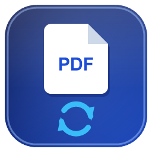

<p align="center">
  
</p>

# miPDFConvert

A virtual PDF printer for Windows. Install it and a new printer named **miPDFConvert**
appears in Windows. Anything you print to it is converted to a PDF, which is then either
handed to a configurable **target application** or offered to you through a *Save As* dialog.

miPDFConvert is a derivative work of [clawPDF](https://github.com/clawsoftware/clawPDF)
(and, through it, [PDFCreator](https://github.com/pdfforge/PDFCreator)) and uses the
[mfilemon](https://sourceforge.net/projects/mfilemon/) print port monitor. It is released
under the **GNU AGPL v3** — see [Licensing](#licensing).

## How it works

```
Application  ──►  "miPDFConvert" printer  ──►  print port monitor (miPortMon)
                                                        │  PostScript spool file
                                                        ▼
                                          miPDFConvertBase (launcher)
                                                        │
                                                        ▼
                                   miPDFConvert  ──►  Ghostscript  ──►  PDF
                                                        │
                        ┌───────────────────────────────┴───────────────────────────────┐
                        ▼                                                               ▼
        TARGET_APPLICATION is set:                                     TARGET_APPLICATION is empty:
        the PDF is passed to that app                                  a "Save As" dialog is shown
```

## Requirements

- **Windows** 10/11 (x64 or ARM64).
- **Ghostscript** — required for the PostScript → PDF conversion. Download and install it
  from the official site:
  **https://www.ghostscript.com/releases/gsdnld.html**
  Install the AGPL release (or obtain a commercial license from Artifex). The printer runs
  as an **x86 (32-bit)** process, so install the **32-bit** Ghostscript build (installing
  both 32- and 64-bit is fine).
- **.NET 8 Desktop Runtime** (bundled/installed by the setup if missing).

## Installation

1. Install **Ghostscript** (see above).
2. Run the installer `miPDFConvertSetup.exe`. During setup you can optionally choose a
   **target application** that should automatically receive the generated PDF — the selected
   path is written to `TARGET_APPLICATION` in `miPDFConvert.dll.config` (leave it empty for a
   *Save As* dialog; changeable later).
3. Print to the **miPDFConvert** printer from any application.

## Configuration

Settings live in `miPDFConvert.dll.config` (next to `miPDFConvert.exe` in the install
directory), under `<appSettings>`:

| Key | Default | Description |
|-----|---------|-------------|
| **`TARGET_APPLICATION`** | *(empty)* | Path or name of an application that should **automatically receive the generated PDF** as a command-line argument. A relative path/bare file name is resolved against the install directory first. **Leave empty to get a *Save As* dialog instead.** |
| `CREATE_DOCUMENT_FILES` | `false` | If `true`, keep the temporary PostScript file in `%TEMP%`. |
| `SOURCE_DOCUMENT_ENCODING` | *(empty = UTF-8)* | Encoding of the source document, e.g. `Windows-1252`. |
| `PDF_SETTINGS` | `/printer` | Ghostscript quality preset: `/printer` (300 dpi, fast), `/prepress` (max quality/size), `/ebook` (150 dpi), `/screen` (72 dpi, smallest). |

### Defining a target application

Set `TARGET_APPLICATION` to the program that should open the freshly created PDF. The PDF
is written to a temporary file and passed as the first argument, so anything that accepts a
file path works — for example a PDF viewer, an archiving tool, or your own application:

```xml
<add key="TARGET_APPLICATION" value="C:\Program Files\YourApp\YourApp.exe" />
```

The **installer** also offers an optional page to pick a target application; the chosen path
is written to this setting during installation (leave it empty for the *Save As* dialog).

The target application is brought to the foreground automatically (including single-instance
apps such as browser-based viewers). If `TARGET_APPLICATION` is empty, miPDFConvert falls
back to a *Save As* dialog.

## Building from source

Prerequisites:

- **Visual Studio 2022** Build Tools with the **C++ (v143)** toolset (for the native print
  monitor) and the **.NET desktop** workload.
- **.NET 8 SDK**.
- **Inno Setup 6** — https://jrsoftware.org/isdl.php (for building the installer).

Build everything (native DLLs → SetupHelper → apps → installer) with the included script:

```powershell
.\build.ps1
```

Useful switches: `-SkipNative` (skip the C++ projects), `-SkipSetup` (binaries only),
`-PlatformToolset v144` (override the C++ toolset). The finished installer is written to
`miPDFConvertSetup\Release\miPDFConvertSetup.exe`.

> **Microsoft PostScript driver files:** The virtual printer uses Microsoft's inbox
> PostScript class driver (`pscript5.dll`, `ps5ui.dll`, `pscript.hlp`, `pscript.ntf`).
> These are **not** redistributed in this repository — `build.ps1` copies them from the
> local Windows driver store into `lib\miMonitor\...` automatically before packaging the
> installer. Only the project's own `ghostpdf.ppd` is tracked in the repository.

### Code signing (optional)

Release builds can be Authenticode-signed; signing is **off by default**. To sign the
project's own binaries and the installer (with timestamp):

```powershell
$env:MIPDF_SIGN_SUBJECT = "Your certificate subject (CN)"
.\build.ps1 -Sign
```

The certificate subject is taken from `-SignSubject` or the `MIPDF_SIGN_SUBJECT`
environment variable and is intentionally **not** stored in the repository. Signing uses
`signtool.exe` (auto-located from the Windows SDK) and the Certum timestamp server. The
installer and uninstaller are signed by Inno Setup through a sign tool named `certum`
that must be configured locally (Inno Setup IDE → *Tools → Configure Sign Tools*);
`build.ps1 -Sign` activates it by passing `/DSIGN` to ISCC.

## Logging

A runtime log is written to `%ProgramData%\miPDFConvert\miPDFConvert.log`.

## Licensing

miPDFConvert is licensed under the **GNU Affero General Public License v3** — see
[`LICENSE`](LICENSE). Because it combines AGPL/GPL components, the complete corresponding
source code must be made available to recipients (including users interacting with it over
a network, per AGPL §13).

Third-party components and their licenses are documented in
[`THIRD-PARTY-NOTICES.md`](THIRD-PARTY-NOTICES.md):

- **mfilemon** (print port monitor) — GPL-2.0-or-later
- **clawPDF / PDFCreator** (setup helper & architecture) — AGPL-3.0
- **Ghostscript** (PDF engine, installed separately) — AGPL-3.0 or commercial (Artifex)
- **log4net**, **Common.Logging** — Apache-2.0
- **Ghostscript.Core.NET**, **System.ComponentModel** — MIT

> **Note on Ghostscript:** miPDFConvert does not bundle Ghostscript; it must be installed
> separately by the user. If you choose to redistribute the Ghostscript binaries with your
> own distribution, the AGPL (or a commercial Artifex license) applies to Ghostscript as well.

This project is not affiliated with or endorsed by clawSoft, pdfforge, or Artifex Software.
